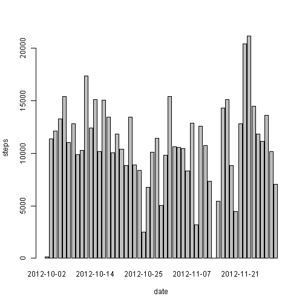
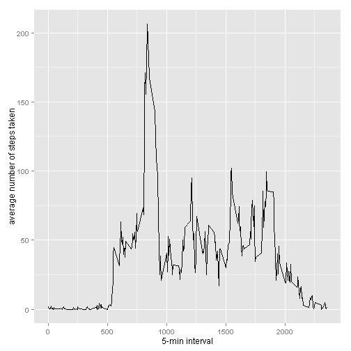
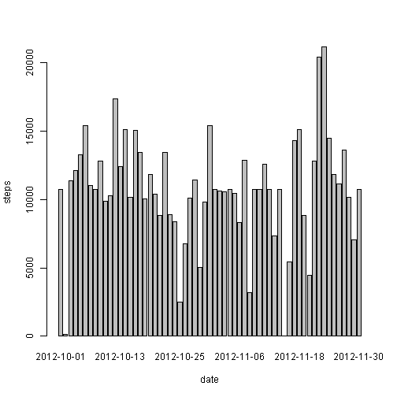
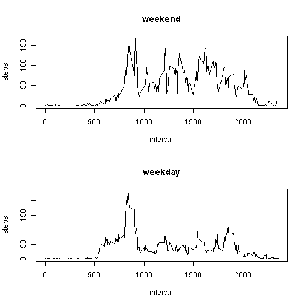

# Reproducible Research: Peer Assessment 1

## Loading and preprocessing the data


```r
setwd("C:/Users/wayfang/Documents/Coursera/Reproducible Research/RepData_PeerAssessment1")
unzip(zipfile="activity.zip")
data <- read.csv("activity.csv")
```

## What is mean total number of steps taken per day?

Calculate the total number of steps taken per day.  Make a histogram of the total number of steps taken each day.

```r
steps.date <- aggregate(steps ~ date, data, FUN=sum)
barplot(steps.date$steps, names.arg=steps.date$date, xlab="date", ylab="steps")
```

 

Calculate and report the **mean** and **median** total number of steps taken per day.

```r
mean(steps.date$steps)
```

```
## [1] 10766.19
```

```r
median(steps.date$steps)
```

```
## [1] 10765
```

## What is the average daily activity pattern?

Make a time series plot (i.e. `type = "l"`) of the 5-minute interval (x-axis) and the average number of steps taken, averaged across all days (y-axis).

```r
library(ggplot2)
averages <- aggregate(x=list(steps=data$steps), by=list(interval=data$interval),
                      FUN=mean, na.rm=TRUE)
ggplot(data=averages, aes(x=interval, y=steps)) +
    geom_line() +
    xlab("5-min interval") +
    ylab("average number of steps taken")
```

 

Which 5-minute interval, on average across all the days in the dataset, contains the maximum number of steps?

```r
averages$interval[which.max(averages$steps)]
```

```
## [1] 835
```

## Imputing missing values

Calculate and report the total number of missing values in the dataset (i.e. the total number of rows with `NA`s)


```r
sum(is.na(data))
```

```
## [1] 2304
```

Fill in all of the missing values in the dataset using the mean for that 5-minute interval.  Create a new dataset that is equal to the original dataset but with the missing data filled in.


```r
data <- merge(data, averages, by="interval", suffixes=c("",".y"))
nas <- is.na(data$steps)
data$steps[nas] <- data$steps.y[nas]
data <- data[,c(1:3)]
```

Make a histogram of the total number of steps taken each day and calculate and report the **mean** and **median** total number of steps taken per day. Do these values differ from the estimates from the first part of the assignment? What is the impact of imputing missing data on the estimates of the total daily number of steps?


```r
steps.date <- aggregate(steps ~ date, data=data, FUN=sum)
barplot(steps.date$steps, names.arg=steps.date$date, xlab="date", ylab="steps")
```

 

```r
mean(steps.date$steps)
```

```
## [1] 10766.19
```

```r
median(steps.date$steps)
```

```
## [1] 10766.19
```

After replacement, the mean is the same but the median is a little bit different.

## Are there differences in activity patterns between weekdays and weekends?

Create a new factor variable in the dataset with two levels --"weekday" and "weekend" indicating whether a given date is a weekday or weekend day.


```r
daytype <- function(date) {
    if (weekdays(as.Date(date)) %in% c("Saturday", "Sunday")) {
        "weekend"
    } else {
        "weekday"
    }
}
data$daytype <- as.factor(sapply(data$date, daytype))
```

Make a panel plot containing a time series plot (i.e. `type = "l"`) of the 5-minute interval (x-axis) and the average number of steps taken, averaged across all weekday days or weekend days (y-axis).


```r
par(mfrow=c(2,1))
for (type in c("weekend", "weekday")) {
    steps.type <- aggregate(steps ~ interval,
                            data,
                            subset=data$daytype==type,
                            FUN=mean)
    plot(steps.type, type="l", main=type)
}
```

 
